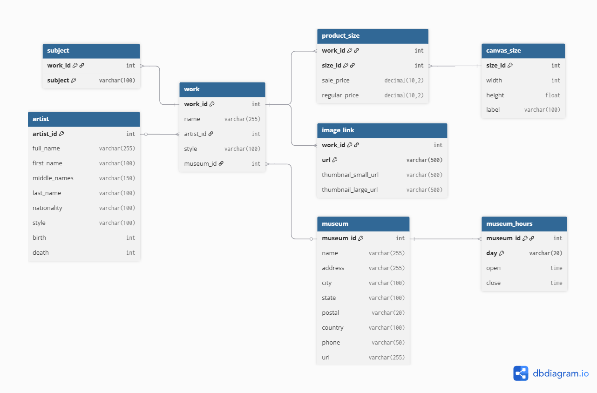

# 🎨 Famous Paintings SQL Project

## 📌 Deskripsi Proyek  
Proyek ini membangun **database relasional** dari dataset *Famous Paintings* yang terdiri dari beberapa file CSV. Setelah database dibuat, dilakukan eksplorasi data menggunakan berbagai **query SQL analitis**.

Proyek ini mencakup:
- Pembuatan struktur database
- Import data dari 8 file CSV
- Analisis menggunakan query SQL

## 🗄️ Struktur Database
 

## 🔍 Query Analisis
- Siapa top-5 seniman dengan jumlah karya terbanyak?
- Apa top-5 kebangsaan yang paling umum dimiliki oleh pelukis?
- Siapa top-5 pelukis yang karyanya paling tersebar di banyak negara?
- Gaya lukisan apa yang paling sering digunakan oleh pelukis yang lahir di setiap abad?
- Lukisan mana saja yang memiliki diskon lebih dari 50%?
- Siapa top-5 pelukis yang rata-rata harga karyanya paling mahal?
- Museum apa saja yang buka setiap hari?
- Sebutkan top-3 negara dengan jumlah museum dan lukisan terbanyak!
- Apa top-5 subjek lukisan apa yang paling sering muncul?

🔗 **Baca di Medium:**  
[https://medium.com/@febriananursyifarizqi/menjelajahi-sejarah-seni-melalui-sql-analisis-data-lukisan-terkenal-8e741b7f9309](https://medium.com/@febriananursyifarizqi/menjelajahi-sejarah-seni-melalui-sql-analisis-data-lukisan-terkenal-8e741b7f9309)
